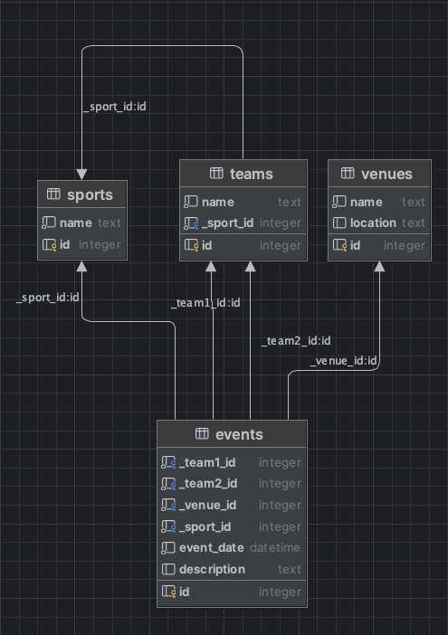

# SimpleEvents

A simple PHP application for managing and viewing sports events, built with an MVC structure.

## Overview

SimpleEvents is a sports event calendar application developed as a coding exercise. It allows users to:
- View sports events with details like teams, venue, date, and description
- Filter events by sport and date
- Add new events through a modal form
- View events in a responsive grid layout

### Features

- **Event Listing**: Display events in a card-based layout
- **Filtering System**: Filter events by sport and date
- **Dynamic Form**: Add new events with automatic team loading based on selected sport
- **Responsive Design**: Works on mobile, tablet, and desktop views
- **SQL Injection Protection**: Uses prepared statements for database queries
- **Input Validation**: Both frontend and backend validation for data integrity

## Database Structure

### ERD Diagram


### Tables
- **sports**: Stores different types of sports
- **teams**: Stores teams with their associated sport
- **venues**: Stores event venues
- **events**: Main table linking teams, venues, and containing event details

## Getting Started

### Minimum Requirements

To run this application, ensure the following requirements are met:

1. **PHP**: Version 8.3 or higher must be installed on your system.
    - Check your PHP version by running: `php -v`
    - [Download PHP](https://www.php.net/downloads)
2. **Composer**: Install Composer to manage dependencies.
    - [Download Composer](https://getcomposer.org/download/)
3. **SQLite**: Ensure the SQLite extension for PHP is enabled.
    - Confirm by running: `php -m | grep sqlite3`
4. **Development Environment**:
    - Any IDE supporting PHP, such as **PHPStorm** or **VSCode**, is recommended.
5. **Web Server**:
    - **Apache**: Required for `.htaccess` configuration. Ensure `mod_rewrite` is enabled.

### Installation

1. Clone the repository:

```bash
git clone https://github.com/lekiq/simpleevents.git
cd simpleevents
```

2. Install dependencies:

```bash
composer install
```

3. Configure environment:
- Rename `.env.test` to `.env`
- Update the `DB_PATH` in `.env` to point to your SQLite database

4. Start the application:

```bash
php -S localhost:8000 -t public
```

## Deployment on Shared Hosting

To deploy SimpleEvents on shared hosting like Hostinger:

1. **Upload Files**:
    - Upload all project files, including the `.htaccess` file, via FTP or File Manager to the root directory (e.g., `/public_html`).

2. **Verify `.htaccess`**:
    - The application uses an `.htaccess` file for routing and securing files.
    - Apache must have the `mod_rewrite` module enabled for this to work.
    - If you encounter issues, contact your hosting provider to confirm `mod_rewrite` is active.

3. **Set File Permissions**:
    - Ensure directories have proper permissions (`755` for directories, `644` for files).

4. **Update `.env` File**:
    - Update the `.env` file to reflect your server’s database path, e.g.:

   ```dotenv
   DB_PATH=/home/yourusername/public_html/database/database.sqlite
   ```

5. **Test the Application**:
    - Access your application at `https://yourdomain.com`.

### Example Hosted Application
You can test the application here: [https://pink-cattle-435369.hostingersite.com/](https://pink-cattle-435369.hostingersite.com/)

## Troubleshooting

### Common Issues

**Issue: 404 Error for Routes**
- **Cause**: `.htaccess` is not properly applied, or `mod_rewrite` is disabled.
- **Solution**: Ensure the `.htaccess` file is uploaded correctly, and `mod_rewrite` is enabled.

**Issue: SQLite Database Not Found**
- **Cause**: Incorrect `DB_PATH` in `.env`.
- **Solution**: Verify the `database.sqlite` file location and path in `.env`.

**Issue: Blank Screen**
- **Cause**: Missing PHP extensions or misconfigured error reporting.
- **Solution**: Ensure PHP extensions are enabled and set `APP_DEBUG=true` in `.env` to display errors.

**Issue: .htaccess Rules Not Applied**
- **Cause**: Apache is not configured to use `.htaccess` files, or `AllowOverride` is disabled.
- **Solution**: Ensure Apache's configuration permits `.htaccess` overrides by setting `AllowOverride All` in the server config.

## Application Structure

### Core Components

- **MVC Architecture**: Follows Model-View-Controller pattern
- **Router**: Custom routing system for handling requests
- **Database**: PDO-based database connection management
- **Config**: Environment variable management using phpdotenv

### Key Files

- `routes.php`: Defines all application routes
- `app/Controllers/EventController.php`: Handles event-related actions
- `app/Models/Event.php`: Event model with database operations
- `app/views/pages/index.php`: Main view template

## Development

### Code Style

The project follows PSR-12 coding standards. Use the following commands:
#### Check code style
```bash
vendor/bin/phpcs
```
#### Fix code style
```bash
vendor/bin/phpcbf
```

### API Endpoints

- `GET /api/sports`: Retrieve all sports with get parameters 
- `GET /api/teams`: Get teams for a specific sport with get parameter `_sport_id`
- `GET /api/venues`: Get all venues
- `POST /events`: Create a new event

## Technical Decisions

1. **SQLite**: Chosen for simplicity and portability
2. **No Frontend Framework**: Pure JavaScript for lighter footprint
3. **CSS Nesting**: Modern CSS approach for maintainable styles
4. **Modal Form**: Enhanced UX for event creation
5. **Prepared Statements**: Security against SQL injection
6. **Apache Dependency**: `.htaccess` is used for routing and securing files, leveraging Apache's `mod_rewrite` capabilities.

## Contributing

If you encounter any issues or have improvements to suggest, feel free to open an issue or submit a pull request on [GitHub](https://github.com/lekiq/simpleevents).

## License

MIT License